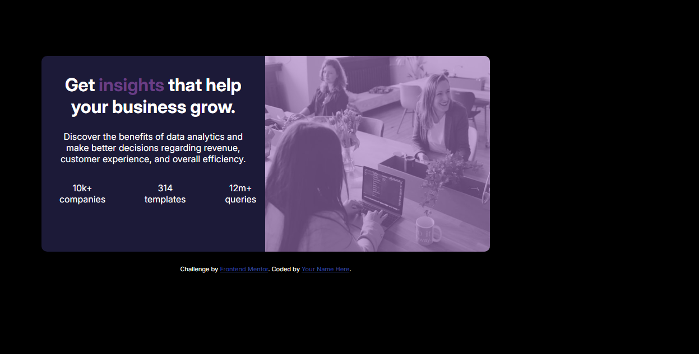

# Frontend Mentor - Stats preview card component solution

This is a solution to the [Stats preview card component challenge on Frontend Mentor](https://www.frontendmentor.io/challenges/stats-preview-card-component-8JqbgoU62). Frontend Mentor challenges help you improve your coding skills by building realistic projects. 

## Table of contents

- [Overview](#overview)
  - [The challenge](#the-challenge)
  - [Screenshot](#screenshot)
  - [Links](#links)
- [My process](#my-process)
  - [Built with](#built-with)
  - [What I learned](#what-i-learned)
  - [Continued development](#continued-development)
  - [Useful resources](#useful-resources)
  - [AI Collaboration](#ai-collaboration)
- [Author](#author)
- [Acknowledgments](#acknowledgments)

## Overview

### The challenge

Users should be able to:

- View the optimal layout depending on their device's screen size

### Screenshot



### Links

- Solution URL: [solution](https://www.frontendmentor.io/solutions/stats-preview-card-component-EW4b-m7Gpf)
- Live Site URL: [live site](https://leadersoxokashe-web.github.io/insights/)

## My process

### Built with

- HTML5
- CSS3
- Flexbox
- Responsive Design

### What I learned

Use this section to recap over some of your major learnings while working through this project. Writing these out and providing code samples of areas you want to highlight is a great way to reinforce your own knowledge.

To see how you can add code snippets, see below:

```html
<h1>Some HTML code I'm proud of</h1>
```
```css
.card-img::after {
  content: "";
  position: absolute;
  top: 0;
  left: 0;
  width: 100%;
  height: 100%;
  background-color: hsl(277, 37%, 61%);
  opacity: 0.6;
  pointer-events: none;
}
```

### Continued development

Use this section to outline areas that you want to continue focusing on in future projects. These could be concepts you're still not completely comfortable with or techniques you found useful that you want to refine and perfect.


### Useful resources

- [Cisco HTML Essentials](https://www.netacad.com/courses/html-essentials?courseLang=en-US) - This helped me for XYZ reason. I really liked this pattern and will use it going forward.

### AI Collaboration

Describe how you used AI tools (if any) during this project. This helps demonstrate your ability to work effectively with AI assistants.

- What tools did you use (I used ChatGPT to understand Flexbox, fix CSS issues, and improve the structure of my HTML.)?
- How did you use them (I used ChatGPT to:
- Debug HTML and CSS errors.
- Generate starter code and boilerplate when needed.
- Brainstorm layout and styling solutions.
- Explain coding concepts and best practices.
- Improve the organization and readability of my code.
)?
- What worked well? What didn't?
ChatGPT was very helpful in explaining concepts, solving layout problems, and suggesting improvements to my code. It saved time when debugging and helped me learn new techniques. However, I still needed to test the code myself and make adjustments to ensure it matched the project requirements and design.


## Author
- [@leadersoxokashe-web](https://www.frontendmentor.io/profile/leadersoxokashe-web)
- [GitHub](https://github.com/leadersoxokashe-web)

## Acknowledgments
I would like to thank Frontend Mentor for providing practical coding challenges that improve frontend development skills. I also appreciate the helpful learning resources from MDN Web Docs, and CSS-Tricks, as well as the guidance provided by ChatGPT during the project.


